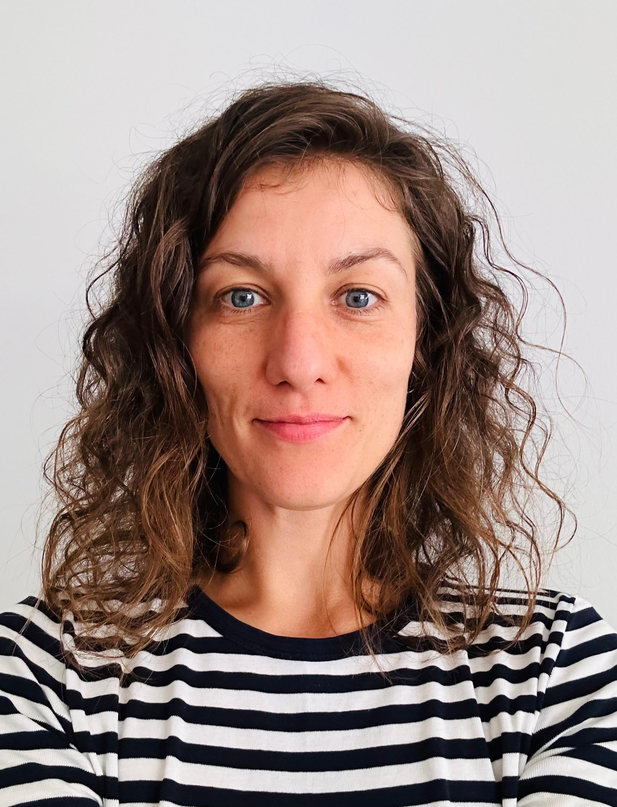

# Ekaterina Vostrikova



## Contacts

**Location:** Torrevieja, Spain

**Email:** ekavos@hotmail.com

**Phone:** +34 xxxxxxxxx **\* \***

**GitHub:** [ekavost](https://github.com/ekavost)

**Discort:** ekavost(@ekavost)

## About

Aspiring web developer with a passion for quality and thoughtful solutions, I am committed to continuous learning and growth. My strengths include teamwork, analytical thinking, and a strong work ethic. Recently completed Higher Technical Degree in Web Application Development, including practical frontend-focused experience. Eager to apply my skills in coding and design.

## Skills

- HTML, CSS, Bootstrap, Tailwind, Prime Vue, Vuetify
- JavaScript, Vue.js
- PHP (basics), Laravel
- C#, ASP.NET
- SQL
- Git, GitHub, VS, VS Code

## Code example

**_Task:_**
_General method for making API requests._

```
				 makeApiRequest(method, url, data = null, errorMessage) {
						return axios[method](url, data)
								.then(response => {
										console.log(response.data); // Log the response for debugging
								})
								.catch(error => {
										console.error(errorMessage, error); // Log error message if something goes wrong
								});
				}
```

## Experience

[CV](https://ekavost.github.io/rsschool-cv/cv)

## Education

- (2017 - 2021) Novosibirsk State University, linguistics (Novosibirsk, Russia)
- (2023 - 2015) IES Mare Nostrum, web-developer (Alicante, Spain)

## English

B2-C1
The level achieved during my university studies.
