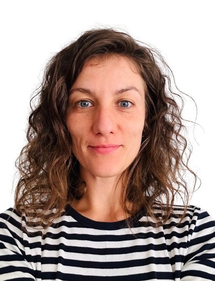

# Ekaterina Vostrikova


## Contacts
**Location:** Torrevieja, Spain

**Email:** ekavos@hotmail.com

**Phone:** +34 645 *** ***

**GitHub:** [ekavost](https://github.com/ekavost)

**Discort:** ekavost(@ekavost)

## About
Aspiring web developer with a passion for quality and thoughtful solutions, I am committed to continuous learning and growth. My strengths include teamwork, analytical thinking, and a strong work ethic. Although my experience lies in the educational sector, I am excited to apply my skills to coding and design.

## Skills
* HTML, CSS
* JavaScript (basics)
* XML, DTD, XPath, XQuery
* C#
* SQL, SQL Server
* Git, GitHub
* VS, VS Code

## Code example
***Task:***
*The first input array is the key to the correct answers to an exam, like `["a", "a", "b", "d"]`. The second one contains a student's submitted answers.The two arrays are not empty and are the same length. Return the score for this array of answers, giving +4 for each correct answer, -1 for each incorrect answer, and +0 for each blank answer, represented as an empty string.*

```
using System;

public static class Kata
{
    public static int CheckExam(string[] arr1, string[] arr2)
    {
        int result = 0;

        for (int i = 0; i < arr1.Length; i++)
        {
          if (arr1[i] == arr2[i])
            result += 4;
          
          else if (arr2[i] != "")
            result -= 1;
        }
      if (result < 0)
        result = 0;
      return result;
    }
}
```
## Experience
[Web page for a coffee shop (training project)](https://ekavost.github.io/coffeShop.github.io/)

[CV](https://github.com/ekavost/rsschool-cv.git)

## Education
* (2017 - 2021) Novosibirsk State University, linguistics (Novosibirsk, Russia)
* (2023 - now) IES Mare Nostrum, web-developer (Alicante, Spain)

## English
B2-C1
The level achieved during my university studies. 
